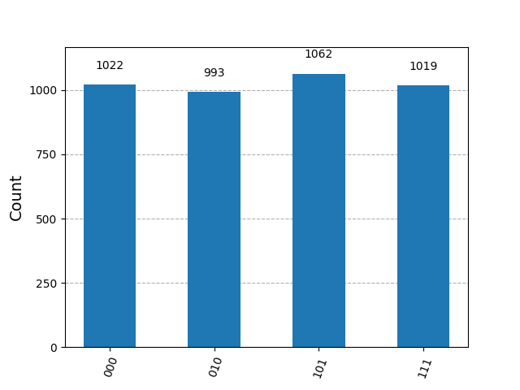
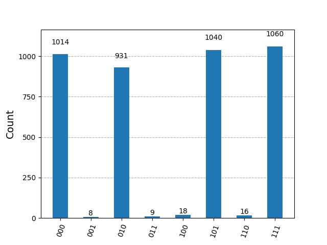

# Quantum Circuit Tests

This repository contains scripts for testing quantum circuits using Qiskit, both on a simulator and on a real IBM quantum computer.

## Files

- `real_test.py`: Executes a quantum circuit on a real IBM quantum computer
- `simulator_test.py`: Executes a quantum circuit on a simulator

## Requirements

- Python 3
- Python3-pip
- Qiskit 1.x
- Qiskit IBM Runtime
- Qiskit Aer
- Matplotlib

## Setup

1. Install the required Python packages:

    ```sh
    pip install qiskit qiskit-ibm-runtime qiskit-aer matplotlib
    ```

2. Configure your IBM Quantum account by saving your API token. It's required only for testing with real quantum computers:

    ```python
    from qiskit_ibm_runtime import QiskitRuntimeService
    QiskitRuntimeService.save_account(channel="ibm_quantum", token="YOUR_API_TOKEN")
    ```

    You can obtain your free API token from the [IBM Quantum](https://quantum.ibm.com/).

## Usage

### Simulator Testing

To execute the quantum circuit on a simulator:

```sh
python simulator_test.py
```

Result:


### Real Quantum Computer Testing

To execute the quantum circuit on a real IBM quantum computer:

```sh
python real_test.py
```

Result:

